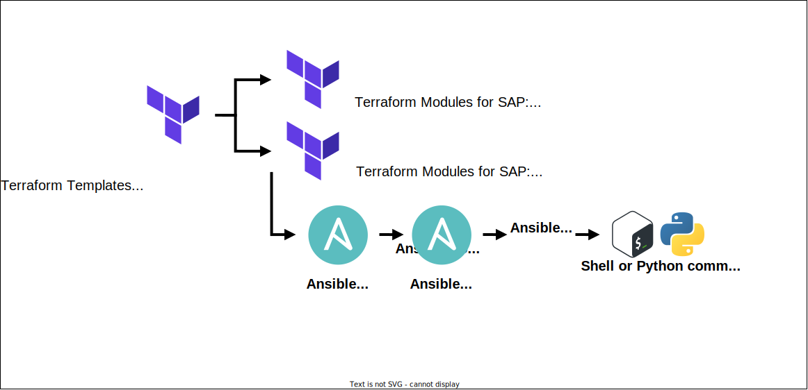

# Terraform Templates for SAP

Deploy various SAP Software solution scenarios onto different Hyperscaler Cloud Service Providers and Hypervisors platforms.

These Terraform Templates for SAP are designed to be:
- simple to understand,
- highly reconfigurable,
- result in an equal installation performed to any Infrastructure Platform (Hyperscaler Cloud Service Providers and Hypervisors platforms),
- use Terraform as Infrastructure-as-Code (IaC),
- and Ansible as Configuration-as-Code (CaC) for configuraton of OS and installation of SAP Software.

**Please read the [full documentation](/docs#readme) for how-to guidance, requirements, and all other details. Summary documentation is below:**
- [Terraform Templates for SAP - summary diagram](#terraform-templates-for-sap---summary-diagram)
- [Terraform Templates for SAP - available scenarios](#terraform-templates-for-sap---available-scenarios)
- [Terraform Templates for SAP - infrastructure provisioning](#terraform-templates-for-sap---infrastructure-provisioning)
- [Disclaimer](#disclaimer)

---

# Terraform Templates for SAP - summary diagram

---

# Terraform Templates for SAP - available scenarios

| SAP Software solution scenario | Infrastructure Platform |
|:--- |:--- |
| **SAP HANA 2.0 (any version)** single-node installation | <ul><li>:white_check_mark: AWS EC2 instance</li><li>:white_check_mark: Google Cloud CE VM</li><li>:white_check_mark: IBM Cloud, Intel VS</li><li>:white_check_mark: IBM Cloud, Power VS</li><li>:white_check_mark: Microsoft Azure VM</li><li>:white_check_mark: IBM PowerVM LPAR</li><li>:white_check_mark: VMware vSphere VM</li></ul> |
| **SAP S/4HANA (2021, 2022)** single-node installation | <ul><li>:white_check_mark: AWS EC2 instance</li><li>:white_check_mark: Google Cloud CE VM</li><li>:white_check_mark: IBM Cloud, Intel VS</li><li>:white_check_mark: IBM Cloud, Power VS</li><li>:white_check_mark: Microsoft Azure VM</li><li>:white_check_mark: IBM PowerVM LPAR</li><li>:white_check_mark: VMware vSphere VM</li></ul> |
| **SAP S/4HANA (2020, 2021, 2022)** single-node installation, using SAP Maintenance Planner Stack XML (to run SUM and SPAM / SAINT) | <ul><li>:white_check_mark: AWS EC2 instance</li><li>:white_check_mark: Google Cloud CE VM</li><li>:white_check_mark: IBM Cloud, Intel VS</li><li>:white_check_mark: IBM Cloud, Power VS</li><li>:white_check_mark: Microsoft Azure VM</li><li>:white_check_mark: IBM PowerVM LPAR</li><li>:white_check_mark: VMware vSphere VM</li></ul> |
| **SAP S/4HANA (2020, 2021, 2022)** Distributed installation (HDB, NWAS ASCS, NWAS PAS, NWAS AAS), using SAP Maintenance Planner Stack XML (to run SUM and SPAM / SAINT) | <ul><li>:white_check_mark: AWS EC2 instance</li><li>:white_check_mark: Google Cloud CE VM</li><li>:white_check_mark: IBM Cloud, Intel VS</li><li>:warning: IBM Cloud, Power VS</li><li>:white_check_mark: Microsoft Azure VM</li><li>:x: IBM PowerVM LPAR</li><li>:x: VMware vSphere VM</li></ul> |
| **SAP S/4HANA (1909, 2020, 2021, 2022)** single-node System Copy installation (Homogeneous with SAP HANA Backup / Recovery) | <ul><li>:warning: AWS EC2 instance</li><li>:warning: Google Cloud CE VM</li><li>:white_check_mark: IBM Cloud, Intel VS</li><li>:white_check_mark: IBM Cloud, Power VS</li><li>:warning: Microsoft Azure VM</li><li>:warning: IBM PowerVM LPAR</li><li>:warning: VMware vSphere VM</li></ul> |
| **SAP BW/4HANA (2021)** single-node installation | <ul><li>:white_check_mark: AWS EC2 instance</li><li>:white_check_mark: Google Cloud CE VM</li><li>:white_check_mark: IBM Cloud, Intel VS</li><li>:white_check_mark: IBM Cloud, Power VS</li><li>:white_check_mark: Microsoft Azure VM</li><li>:white_check_mark: IBM PowerVM LPAR</li><li>:white_check_mark: VMware vSphere VM</li></ul> |
| **SAP ECC on SAP HANA (EHP7, EHP8)** single-node installation | <ul><li>:white_check_mark: AWS EC2 instance</li><li>:white_check_mark: Google Cloud CE VM</li><li>:white_check_mark: IBM Cloud, Intel VS</li><li>:white_check_mark: IBM Cloud, Power VS</li><li>:white_check_mark: Microsoft Azure VM</li><li>:white_check_mark: IBM PowerVM LPAR</li><li>:white_check_mark: VMware vSphere VM</li></ul> |
| **SAP ECC on SAP HANA (EHP7, EHP8)** single-node System Copy installation (Homogeneous with SAP HANA Backup / Recovery) | <ul><li>:warning: AWS EC2 instance</li><li>:warning: Google Cloud CE VM</li><li>:white_check_mark: IBM Cloud, Intel VS</li><li>:white_check_mark: IBM Cloud, Power VS</li><li>:warning: Microsoft Azure VM</li><li>:warning: IBM PowerVM LPAR</li><li>:warning: VMware vSphere VM</li></ul> |
| **SAP ECC on IBM Db2 (EHP7, EHP8)** single-node installation | <ul><li>:white_check_mark: AWS EC2 instance</li><li>:white_check_mark: Google Cloud CE VM</li><li>:white_check_mark: IBM Cloud, Intel VS</li><li>:no_entry_sign: IBM Cloud, Power VS</li><li>:white_check_mark: Microsoft Azure VM</li><li>:no_entry_sign: IBM PowerVM LPAR</li><li>:white_check_mark: VMware vSphere VM</li></ul> |
| **SAP ECC on Oracle DB (EHP7, EHP8)** single-node installation | <ul><li>:white_check_mark: AWS EC2 instance</li><li>:white_check_mark: Google Cloud CE VM</li><li>:white_check_mark: IBM Cloud, Intel VS</li><li>:no_entry_sign: IBM Cloud, Power VS</li><li>:white_check_mark: Microsoft Azure VM</li><li>:no_entry_sign: IBM PowerVM LPAR</li><li>:white_check_mark: VMware vSphere VM</li></ul> |
| **SAP ECC on SAP ASE (EHP7, EHP8)** single-node installation | <ul><li>:white_check_mark: AWS EC2 instance</li><li>:white_check_mark: Google Cloud CE VM</li><li>:white_check_mark: IBM Cloud, Intel VS</li><li>:no_entry_sign: IBM Cloud, Power VS</li><li>:white_check_mark: Microsoft Azure VM</li><li>:no_entry_sign: IBM PowerVM LPAR</li><li>:white_check_mark: VMware vSphere VM</li></ul> |
| **SAP ECC on SAP MaxDB (EHP7, EHP8)** single-node installation | <ul><li>:white_check_mark: AWS EC2 instance</li><li>:white_check_mark: Google Cloud CE VM</li><li>:white_check_mark: IBM Cloud, Intel VS</li><li>:no_entry_sign: IBM Cloud, Power VS</li><li>:white_check_mark: Microsoft Azure VM</li><li>:no_entry_sign: IBM PowerVM LPAR</li><li>:white_check_mark: VMware vSphere VM</li></ul> |
| **SAP NetWeaver AS (ABAP) with SAP HANA (7.50, 7.52)** single-node installation | <ul><li>:white_check_mark: AWS EC2 instance</li><li>:white_check_mark: Google Cloud CE VM</li><li>:white_check_mark: IBM Cloud, Intel VS</li><li>:white_check_mark: IBM Cloud, Power VS</li><li>:white_check_mark: Microsoft Azure VM</li><li>:white_check_mark: IBM PowerVM LPAR</li><li>:white_check_mark: VMware vSphere VM</li></ul> |
| **SAP NetWeaver AS (ABAP) with IBM Db2 (7.50, 7.52)** single-node installation | <ul><li>:white_check_mark: AWS EC2 instance</li><li>:white_check_mark: Google Cloud CE VM</li><li>:white_check_mark: IBM Cloud, Intel VS</li><li>:no_entry_sign: IBM Cloud, Power VS</li><li>:white_check_mark: Microsoft Azure VM</li><li>:no_entry_sign: IBM PowerVM LPAR</li><li>:white_check_mark: VMware vSphere VM</li></ul> |
| **SAP NetWeaver AS (ABAP) with Oracle DB (7.50, 7.52)** single-node installation | <ul><li>:white_check_mark: AWS EC2 instance</li><li>:white_check_mark: Google Cloud CE VM</li><li>:white_check_mark: IBM Cloud, Intel VS</li><li>:no_entry_sign: IBM Cloud, Power VS</li><li>:white_check_mark: Microsoft Azure VM</li><li>:no_entry_sign: IBM PowerVM LPAR</li><li>:white_check_mark: VMware vSphere VM</li></ul> |
| **SAP NetWeaver AS (ABAP) with SAP ASE (7.50, 7.52)** single-node installation | <ul><li>:white_check_mark: AWS EC2 instance</li><li>:white_check_mark: Google Cloud CE VM</li><li>:white_check_mark: IBM Cloud, Intel VS</li><li>:no_entry_sign: IBM Cloud, Power VS</li><li>:white_check_mark: Microsoft Azure VM</li><li>:no_entry_sign: IBM PowerVM LPAR</li><li>:white_check_mark: VMware vSphere VM</li></ul> |
| **SAP NetWeaver AS (ABAP) with SAP MaxDB (7.50, 7.52)** single-node installation | <ul><li>:white_check_mark: AWS EC2 instance</li><li>:white_check_mark: Google Cloud CE VM</li><li>:white_check_mark: IBM Cloud, Intel VS</li><li>:no_entry_sign: IBM Cloud, Power VS</li><li>:white_check_mark: Microsoft Azure VM</li><li>:no_entry_sign: IBM PowerVM LPAR</li><li>:white_check_mark: VMware vSphere VM</li></ul> |
| **SAP NetWeaver AS (`JAVA`) with IBM Db2 (7.50)** single-node installation | <ul><li>:white_check_mark: AWS EC2 instance</li><li>:white_check_mark: Google Cloud CE VM</li><li>:white_check_mark: IBM Cloud, Intel VS</li><li>:no_entry_sign: IBM Cloud, Power VS</li><li>:white_check_mark: Microsoft Azure VM</li><li>:no_entry_sign: IBM PowerVM LPAR</li><li>:white_check_mark: VMware vSphere VM</li></ul> |
| **SAP NetWeaver AS (`JAVA`) with SAP ASE (7.50)** single-node installation | <ul><li>:white_check_mark: AWS EC2 instance</li><li>:white_check_mark: Google Cloud CE VM</li><li>:white_check_mark: IBM Cloud, Intel VS</li><li>:no_entry_sign: IBM Cloud, Power VS</li><li>:white_check_mark: Microsoft Azure VM</li><li>:no_entry_sign: IBM PowerVM LPAR</li><li>:white_check_mark: VMware vSphere VM</li></ul> |
| **SAP Solution Manager 7.2 SP2 (`ABAP/JAVA`) with SAP ASE** single-node installation | <ul><li>:white_check_mark: AWS EC2 instance</li><li>:white_check_mark: Google Cloud CE VM</li><li>:white_check_mark: IBM Cloud, Intel VS</li><li>:no_entry_sign: IBM Cloud, Power VS</li><li>:white_check_mark: Microsoft Azure VM</li><li>:no_entry_sign: IBM PowerVM LPAR</li><li>:x: VMware vSphere VM</li></ul> |
| **SAP Solution Manager 7.2 SP2 (`ABAP/JAVA`) with SAP HANA** single-node installation | <ul><li>:white_check_mark: AWS EC2 instance</li><li>:white_check_mark: Google Cloud CE VM</li><li>:white_check_mark: IBM Cloud, Intel VS</li><li>:no_entry_sign: IBM Cloud, Power VS</li><li>:white_check_mark: Microsoft Azure VM</li><li>:no_entry_sign: IBM PowerVM LPAR</li><li>:x: VMware vSphere VM</li></ul> |

**Key:**
- :white_check_mark: Ready and Tested
- :warning: Pending work; either the Terraform Template has not been created/tested for this SAP solution scenario and infrastructure platform, or work is pending to underlying [Terraform Modules for SAP](https://github.com/sap-linuxlab/terraform.modules_for_sap)
- :x: Not available yet
- :no_entry_sign: Not provided by SAP

---

# Terraform Templates for SAP - infrastructure provisioning

The following is an overview of the Infrastructure-as-Code (IaC) provisioning, for full details please see the underlying [Terraform Modules for SAP documentation](https://github.com/sap-linuxlab/terraform.modules_for_sap#terraform-modules-for-sap).

| Infrastructure Platform | **Amazon Web Services (AWS)** | **Google Cloud** | **Microsoft Azure** | **IBM Cloud** | **IBM Cloud** | **IBM PowerVC** | **VMware vSphere** |
|:---|:---:|:---:|:---:|:---:|:---:|:---:|:---:|
| &emsp;&emsp;*Product* | EC2 Virtual Server | VM | VM | Virtual Server | IBM Power Virtual Server | LPAR | VM |
|   ***Account Init*** |   |   |   |   |   |   |   |
| Create Resource Group. Or re-use existing Resource Group | :no_entry_sign: | :no_entry_sign: | :white_check_mark: | :white_check_mark: | :white_check_mark: | N/A | N/A |
| Create Networks (VPC/VNet), Subnets, and Internet Access. Or re-use existing VPC/VNet | :white_check_mark: | :white_check_mark: | :white_check_mark: | :white_check_mark: | :white_check_mark: | N/A | N/A |
|  ***Account Bootstrap (aka. minimal landing zone)*** |   |   |   |   |   |   |   |
| Create Private DNS, Network Security | :white_check_mark: | :white_check_mark: | :white_check_mark: | :white_check_mark: | :white_check_mark: | N/A | N/A |
| Create Network Interconnectivity hub | :white_check_mark: | :no_entry_sign: | :no_entry_sign: | :white_check_mark: | :white_check_mark: | N/A | N/A |
| Create TLS key pair for SSH and Import to Cloud Platform | :white_check_mark: | :no_entry_sign: | :white_check_mark: | :white_check_mark: | :white_check_mark: | :white_check_mark: | :white_check_mark: |
|  ***Bastion Injection*** |   |   |   |   |   |   |   |
| Create Subnet and Network Security for Bastion | :white_check_mark: | :white_check_mark: | :white_check_mark: | :white_check_mark: | :white_check_mark: | N/A | N/A |
| Create Bastion host and Public IP address | :white_check_mark: | :white_check_mark: | :white_check_mark: | :white_check_mark: | :white_check_mark: | N/A | N/A |
|  ***Host Network Access for SAP*** |   |   |   |   |   |   |   |
| Append Network Security rules for SAP | :white_check_mark: | :white_check_mark: | :white_check_mark: | :white_check_mark: | :white_check_mark: | N/A | N/A |
|  ***Host NFS*** |   |   |   |   |   |   |   |
| Create NFS Share | :white_check_mark: | :white_check_mark: | :white_check_mark: | :white_check_mark: | :warning: | N/A | N/A |
|  ***Host Provision*** |   |   |   |   |   |   |   |
| Create DNS Records (i.e. A, CNAME, PTR) | :white_check_mark: | :white_check_mark: | :white_check_mark: | :white_check_mark: | :white_check_mark: | N/A | N/A |
| Create Storage Volumes (Profile or Custom IOPS) | :white_check_mark: | :white_check_mark: | :white_check_mark: | :white_check_mark: | :warning: no custom IOPS | :white_check_mark: | :white_check_mark: |
| Create Host/s | :white_check_mark: | :white_check_mark: | :white_check_mark: | :white_check_mark: | :white_check_mark: | :white_check_mark: | :white_check_mark: |

**Key:**
- :white_check_mark: Ready and Tested
- :warning: Pending work
- :x: Not available yet
- :no_entry_sign: Capability not provided by vendor (or construct concept does not exist)

---

# Disclaimer

These are common SAP solution scenarios which are codified using Infrastructure Automation for SAP (Terraform) and Build Automation for SAP (Ansible). These can be extended as needed for bespoke requirements.

This does not intend (and can not) replicate every SAP software deployment scenario, and does not replace any existing SAP installation procedures detailed in the [SAP Help Portal](https://help.sap.com) or [SAP Notes on SAP ONE Support](https://launchpad.support.sap.com). However, with the Ansible Role for SAP SWPM it is possible to install any SAP Software which is supported by SAP Software Provisioning Manager (SWPM 1.0/2.0).

For move-fast activities, such as rapid provisioning and administration testing tasks (latest software releases and revision/patch levels, system copy restore to Cloud etc.), these Terraform Templates for SAP can be amended to suit these requirements.

For greater support in automating the lifecycle of SAP Systems themselves, it is recommended to consider [SAP Landscape Management Enterprise Edition](https://www.sap.com/uk/products/landscape-management.html).

For greater demo and evaluation of SAP Software business functionality, it is recommended to consider [SAP Cloud Appliance Library](https://www.sap.com/products/cloud-appliance-library.html).
