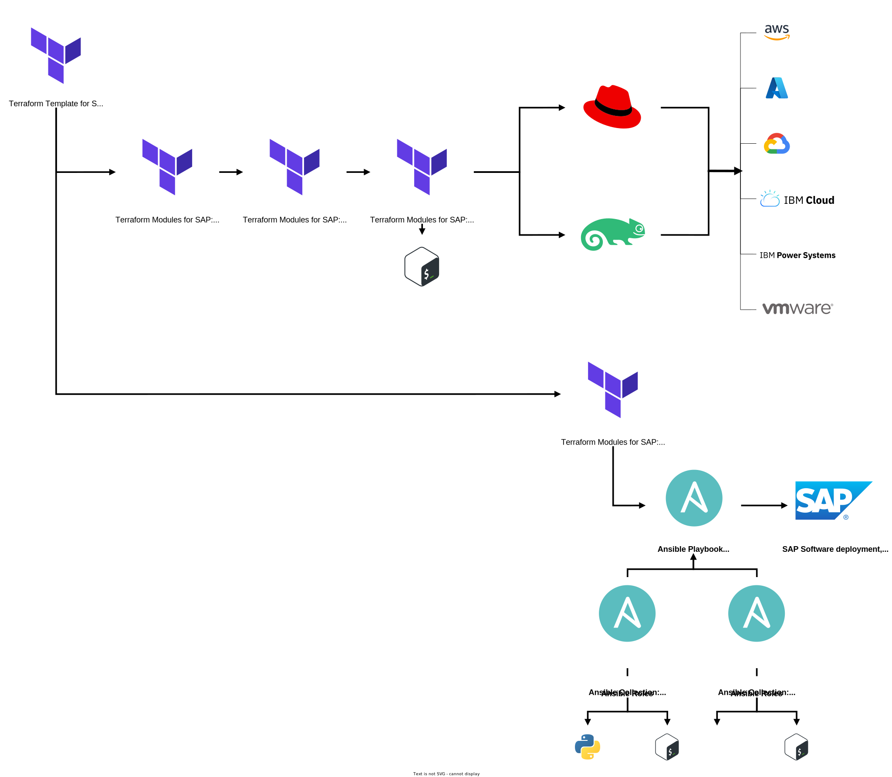

# Terraform Templates for SAP

Terraform Templates for deployment of various SAP Software solution scenarios onto different Hyperscaler Cloud Service Providers and Hypervisors platforms.

These Terraform Templates for SAP are designed to be simple to understand and highly reconfigurable. Each Terraform Template uses the [Terraform Modules for SAP](https://github.com/sap-linuxlab/terraform.modules_for_sap).

Project is built of two components:
- Infrastructure-as-Code (IaC) for deployment of host infrastructure. Uses Terraform.
- Configuration-as-Code (CaC) for configuraton of OS and installation of SAP Software. Uses Ansible, dynamically altered by Terraform.

# Get started

It is recommended to read the README below for context and understanding, before you execute this code.

To get started immediately, requirements:
- Terraform and Ansible installed
- Infrastructure Platform credentials; depending on choice may require OS Vendor subscription
- SAP ONE Support Launchpad credentials, with Software Download privileges
- Optional depending on choice SAP solution scenario: SAP System Copy backup file

To get started immediately, execute from your command line:
```
# Install Terraform
# https://learn.hashicorp.com/tutorials/terraform/install-cli

# Install Ansible Core (or superset, Ansible Community Edition)
# (e.g. on macOS, brew install ansible)

# Download from GitHub.com repository
# (e.g. on macOS, curl -L https://github.com/sap-linuxlab/terraform.templates_for_sap/archive/refs/heads/main.zip)

# Extract ZIP
# (e.g. on Windows 10, tar -xf main.zip)

# Run and follow prompts
./run_terraform.sh
```

---

## Introduction

This project is designed to be outcome-focused and highly-reusable.

Each Terraform Template is for a pre-defined SAP Software solution scenario on a given Infrastructure Platform, e.g. SAP HANA installation to Microsoft Azure, or SAP ECC on HANA System Copy (Homogeneous) to IBM Cloud.

These Terraform Templates are constructed using the custom [Terraform Modules for SAP](https://github.com/sap-linuxlab/terraform.modules_for_sap), which can be combined to create new Terraform Templates for different scenarios. **The provided solution scenarios are a baseline, from which amendments and extensions can be made to create any SAP Software solution scenario on any Infrastructure Platform.**

The project addresses common SAP System activities such as:
- initial SAP software installations (Maintenance Planner)
- move or clone SAP Systems to new infrastructure (System Copy)

The project therefore assists SAP-run enterprises to achieve various outcomes, such as:
| Business requirement | Potential activities assisted by this project |
| --- | --- |
| **Migration to SAP S/4HANA AnyPremise:** | **Greenfield**; perform a new installation from SAP Maintenance Planner |
| | **Brownfield**; perform a backup, execute a System Copy (Homogenous) and execute DMO for SUM with System Move, begin testing activities, add to remediation plan, repeat until cutover plan completed |
| | **Selective Data Transition**; perform a backup, execute a System Copy (Homogenous), execute Shell Conversion or Mix&Match, begin testing activities, add to remediation plan, repeat until cutover plan completed |
| **Datacenter Exit / Cloud Service Provider switch:** | **Compute Re-locate**; perform a backup, execute a System Copy (Homogenous) to a target infrastructure, begin testing activities, add to remediation plan, repeat until cutover plan completed |
| | **Compute Re-locate and move to SAP HANA**; perform a backup, execute a System Copy (Homogenous), upgrade ECC EHP and SAP NetWeaver versions, then System Copy (Heterogeneous) using SWPM |
| **Enterprise re-structures:** | **Spin-offs and Divestitures** (Grow through focus on core value); define split-by action *(e.g. Organizational Units such as Company Code, Plants, Controlling area, Profit centers)*, perform a backup, execute a System Copy (Homogenous), perform carve-out activities, begin testing activities, add to remediation plan, repeat until cutover plan completed |
| | **Mergers and Acquisitions** (Grow through expansion); merge of SAP Systems, perform a backup of each, execute a System Copy (Homogenous) of each, upgrade to ECC EHP and SAP NetWeaver versions to match, smoke test functionality of both post-upgrade, begin testing and identification of business process alterations with the corresponding creation of Transports (e.g. altered BC Sets) to manually move |

## Execution workflow structure

Each Terraform Template is for a deployment of a SAP Software solution scenario to a platform, and reuses custom [Terraform Modules for SAP](https://github.com/sap-linuxlab/terraform.modules_for_sap) to provision resources (e.g. host machines) and execute Ansible Playbooks (referencing Ansible Collection Role/s) for configuration of OS and installation of SAP software.

Segregation of definitions for the Infrastructure and SAP Software follows the same delineation:
- Terraform defines the Infrastructure Specification templates
- Ansible defines the SAP Software installation / SAP System templates

An overview of the execution flow is provided in the image below, for full details please see:
- [the Execution Flow documentation](/docs/EXECUTION_FLOW.md)
- [the Infrastructure Platform guidance to use Terraform Templates for SAP](/docs/INFRASTRUCTURE_GUIDANCE.md)
- [the detailed documentation in Terraform Modules for SAP](https://github.com/sap-linuxlab/terraform.modules_for_sap)



## Available SAP solution scenarios and Infrastructure Platforms

The following is a list of Infrastructure Platforms and Operating System vendors which the Terraform Templates are compatible with, and the various SAP solution scenarios which are developed.

**Hyperscaler Cloud Service Providers, provisioned via Terraform:**
- Amazon Web Services (AWS), EC2 instance (Intel Virtual Machine)
- ~~Google Cloud Platform (GCP), Compute Engine Intel Virtual Machine~~ `[after initial release]`
- IBM Cloud, Intel Virtual Server
- IBM Cloud, IBM Power Virtual Server
- Microsoft Azure, Intel Virtual Machine

**Hypervisors, provisioned via Terraform:**
- IBM PowerVM LPAR
- ~~OVirt / Red Hat Virtualization Virtual Machine~~ `[after initial release]`
- ~~VMware vSphere Virtual Machine~~ `[after initial release]`

**Operating Systems:**
- Red Hat Enterprise Linux for SAP Solutions (RHEL4SAP)
- SUSE Linux Enterprise Server for SAP Applications (SLES4SAP)

**Solution Architecture scenarios, provisioned via Ansible:**
| Scenario | Description | Infrastructure Platform&emsp;&emsp;&emsp;&emsp;&emsp;&emsp;&emsp;&emsp;&emsp; |
|:--- |:--- |:--- |
| **SAP HANA single-node installation** | Installation of SAP HANA Database Server to a single virtual machine on a Cloud or Hypervisor | <ul><li>:white_check_mark: AWS EC2</li><li>:x: GCP VM</li><li>:white_check_mark: IBM Cloud, Intel VS</li><li>:white_check_mark: IBM Cloud, Power VS</li><li>:white_check_mark: Microsoft Azure</li><li>:white_check_mark: IBM PowerVM LPAR</li><li>:x: OVirt VM</li><li>:x: VMware vSphere VM</li></ul> |
| **SAP S/4HANA single-node installation, using SAP Maintenance Planner** | Installation of SAP S/4HANA using SAP HANA Database Server and SAP NetWeaver to a single virtual machine on a Cloud or Hypervisor | <ul><li>:white_check_mark: AWS EC2</li><li>:x: GCP VM</li><li>:white_check_mark: IBM Cloud, Intel VS</li><li>:white_check_mark: IBM Cloud, Power VS</li><li>:white_check_mark: Microsoft Azure</li><li>:white_check_mark: IBM PowerVM LPAR</li><li>:x: OVirt VM</li><li>:x: VMware vSphere VM</li></ul> |
| **SAP S/4HANA single-node System Copy (Homogeneous with SAP HANA Backup / Recovery) installation** | Installation of SAP S/4HANA from an SAP HANA data backup file and using SAP HANA Database Server and SAP NetWeaver to a single virtual machine on a Cloud or Hypervisor | <ul><li>:warning: AWS EC2</li><li>:x: GCP VM</li><li>:white_check_mark: IBM Cloud, Intel VS</li><li>:white_check_mark: IBM Cloud, Power VS</li><li>:warning: Microsoft Azure</li><li>:warning: IBM PowerVM LPAR</li><li>:x: OVirt VM</li><li>:x: VMware vSphere VM</li></ul> |
| **SAP ECC on SAP HANA single-node System Copy** | Installation of SAP ECC from an SAP HANA data backup file and using SAP HANA Database Server and SAP NetWeaver to a single virtual machine on a Cloud or Hypervisor | <ul><li>:warning: AWS EC2</li><li>:x: GCP VM</li><li>:white_check_mark: IBM Cloud, Intel VS</li><li>:warning: IBM Cloud, Power VS</li><li>:warning: Microsoft Azure</li><li>:warning: IBM PowerVM LPAR</li><li>:x: OVirt VM</li><li>:x: VMware vSphere VM</li></ul> |

Key:
- :white_check_mark: Ready and Tested
- :warning: Pending work; either the Terraform Template has not been created/tested for this SAP solution scenario and infrastructure platform, or work is pending to underlying [Terraform Modules for SAP](https://github.com/sap-linuxlab/terraform.modules_for_sap)
- :x: Not available yet

**Future SAP solution scenarios:**

There are various suggested/requested SAP solution scenarios under consideration by the SAP LinuxLab open-source team (across multiple SAP Technology Partners), which have been suggested from customers and SAP Service Partners.

While the Ansible Collections for SAP are compatbile with almost any installation (e.g. SAP SolMan, SAP WebDispatcher, SAP BW/4HANA) - our focus in this project is to provide a common end-to-end automated deployment for common scenarios, therefore we are unable to working code for all combinations. For additional detail, see [Disclaimer](#disclaimer) section.

Any contributors who would are available for development and testing of these proposed future SAP solution scenarios in this project are greatly welcomed, please read the [Contributors document](/docs/CONTRIBUTORS.md). As described in the SAP LinuxLab initiative governance processes, any customer or SAP Partner may submit proposals of new code or direction.

The following list is **`not`** a commitment but is a statement of intent beyond the initial release, the terraform.templates_for_sap project seeks to include in future:

| Proposed future SAP solution scenario | Description |
| --- | --- |
| *SAP HANA multi-node HA/DR installation* | Install of SAP HANA Database Server to multiple virtual machines on a Cloud or Hypervisor, and setup of HA/DR fencing agents and resource agents |
| *SAP HANA multi-node scale-out cluster* installation | Install of SAP HANA Database Server to multiple virtual machines on a Cloud or Hypervisor, and setup of scale-out cluster for OLAP workloads (e.g. SAP BW/4HANA) |
| *SAP S/4HANA distributed installation* | Installation of SAP S/4HANA using SAP HANA Database Server and SAP NetWeaver across multiple virtual machine on a Cloud or Hypervisor |
| *SAP BW/4HANA single-node installation* | Installation of SAP BW/4HANA using SAP HANA Database Server and SAP NetWeaver to a single virtual machine on a Cloud or Hypervisor |

## Disclaimer

These are common SAP solution scenarios which are codified using Infrastructure Automation for SAP (Terraform) and Build Automation for SAP (Ansible). These can be extended as needed for bespoke requirements.

This does not intend (and can not) replicate every SAP software deployment scenario, and does not replace any existing SAP installation procedures detailed in the [SAP Help Portal](https://help.sap.com) or [SAP Notes on SAP ONE Support](https://launchpad.support.sap.com). However, with the Ansible Role for SAP SWPM is possible to install any SAP Software which is supported by SAP Software Provisioning Manager (SWPM 1.0/2.0).

For move-fast activities, such as rapid provisioning and administration testing tasks (latest software releases and revision/patch levels, system copy restore to Cloud etc.), these Terraform Templates for SAP can be amended to suit these requirements.

For greater support in automating the lifecycle of SAP Systems themselves, it is recommended to consider [SAP Landscape Management Enterprise Edition](https://www.sap.com/uk/products/landscape-management.html).

For greater demo and evaluation of SAP Software business functionality, it is recommended to consider [SAP Cloud Appliance Library](https://www.sap.com/products/cloud-appliance-library.html).
