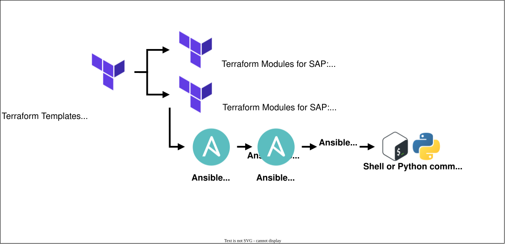

# Terraform Templates for SAP

Deploy various SAP Software solution scenarios onto different Hyperscaler Cloud Service Providers and Hypervisors platforms.

These Terraform Templates for SAP are designed to be:
- simple to understand,
- highly reconfigurable,
- result in an equal installation performed to any Infrastructure Platform (Hyperscaler Cloud Service Providers and Hypervisors platforms),
- use Terraform as Infrastructure-as-Code (IaC),
- and Ansible as Configuration-as-Code (CaC) for configuraton of OS and installation of SAP Software.

**Please read the [full documentation](/docs#readme) for how-to guidance, requirements, and all other details. Summary documentation is below:**
- [Terraform Templates for SAP - summary diagram](#terraform-templates-for-sap---summary-diagram)
- [Terraform Templates for SAP - available scenarios](#terraform-templates-for-sap---available-scenarios)
- [Terraform Templates for SAP - infrastructure provisioning](#terraform-templates-for-sap---infrastructure-provisioning)
- [Disclaimer](#disclaimer)

---

# Terraform Templates for SAP - summary diagram

---

# Terraform Templates for SAP - available scenarios

The Terraform Templates for SAP, leverage the [Ansible Playbooks for SAP project](https://github.com/sap-linuxlab/ansible.playbooks_for_sap).

Each Terraform Template for a different Infrastructure Platform, is constructured using:
- [Terraform Modules for SAP](https://github.com/sap-linuxlab/terraform.modules_for_sap)
  - Init and Bootstrap
  - Bastion (when Cloud IaaS)
  - Network Access and NFS
  - Host provision
  - Terraform Module wrapper to download and run an [Ansible Playbook for SAP](https://github.com/sap-linuxlab/ansible.playbooks_for_sap).

A full list of the available scenarios is available in the [README of Ansible Playbooks for SAP](https://github.com/sap-linuxlab/ansible.playbooks_for_sap?tab=readme-ov-file#supported-deployment-scenarios)

**NOTE: The Terraform Templates provided are purposefully limited, and do not include High Availability, Scale-Out, or Landscape scenarios. Please use the Ansible Playbooks for SAP for provision and deployment of these scenarios.**

---

# Terraform Templates for SAP - infrastructure provisioning

The following is an overview of the Infrastructure-as-Code (IaC) provisioning, for full details please see the underlying [Terraform Modules for SAP documentation](https://github.com/sap-linuxlab/terraform.modules_for_sap#terraform-modules-for-sap).

| Infrastructure Platform | **Amazon Web Services (AWS)** | **Google Cloud** | **Microsoft Azure** | **IBM Cloud** | **IBM Cloud** | **IBM PowerVC** | **VMware vSphere** |
|:---|:---:|:---:|:---:|:---:|:---:|:---:|:---:|
| &emsp;&emsp;*Product* | EC2 Virtual Server | VM | VM | Virtual Server | IBM Power Virtual Server | LPAR | VM |
|   ***Account Init*** |   |   |   |   |   |   |   |
| Create Resource Group. Or re-use existing Resource Group | :no_entry_sign: | :no_entry_sign: | :white_check_mark: | :white_check_mark: | :white_check_mark: | N/A | N/A |
| Create Networks (VPC/VNet), Subnets, and Internet Access. Or re-use existing VPC/VNet | :white_check_mark: | :white_check_mark: | :white_check_mark: | :white_check_mark: | :white_check_mark: | N/A | N/A |
|  ***Account Bootstrap (aka. minimal landing zone)*** |   |   |   |   |   |   |   |
| Create Private DNS, Network Security | :white_check_mark: | :white_check_mark: | :white_check_mark: | :white_check_mark: | :white_check_mark: | N/A | N/A |
| Create Network Interconnectivity hub | :white_check_mark: | :no_entry_sign: | :no_entry_sign: | :white_check_mark: | :white_check_mark: | N/A | N/A |
| Create TLS key pair for SSH and Import to Cloud Platform | :white_check_mark: | :no_entry_sign: | :white_check_mark: | :white_check_mark: | :white_check_mark: | :white_check_mark: | :white_check_mark: |
|  ***Bastion Injection*** |   |   |   |   |   |   |   |
| Create Subnet and Network Security for Bastion | :white_check_mark: | :white_check_mark: | :white_check_mark: | :white_check_mark: | :white_check_mark: | N/A | N/A |
| Create Bastion host and Public IP address | :white_check_mark: | :white_check_mark: | :white_check_mark: | :white_check_mark: | :white_check_mark: | N/A | N/A |
|  ***Host Network Access for SAP*** |   |   |   |   |   |   |   |
| Append Network Security rules for SAP | :white_check_mark: | :white_check_mark: | :white_check_mark: | :white_check_mark: | :white_check_mark: | N/A | N/A |
|  ***Host NFS*** |   |   |   |   |   |   |   |
| Create NFS Share | :white_check_mark: | :white_check_mark: | :white_check_mark: | :white_check_mark: | :white_check_mark: | N/A | N/A |
|  ***Host Provision*** |   |   |   |   |   |   |   |
| Create DNS Records (i.e. A, CNAME, PTR) | :white_check_mark: | :white_check_mark: | :white_check_mark: | :white_check_mark: | :white_check_mark: | N/A | N/A |
| Create Storage Volumes (Profile or Custom IOPS) | :white_check_mark: | :white_check_mark: | :white_check_mark: | :white_check_mark: | :warning: no custom IOPS | :white_check_mark: | :white_check_mark: |
| Create Host/s | :white_check_mark: | :white_check_mark: | :white_check_mark: | :white_check_mark: | :white_check_mark: | :white_check_mark: | :white_check_mark: |

> :no_entry_sign: Capability not provided by vendor (or construct concept does not exist)

---

# Disclaimer

These are common SAP solution scenarios which are codified using Infrastructure Automation for SAP (Terraform) and Build Automation for SAP (Ansible). These can be extended as needed for bespoke requirements.

This does not intend (and can not) replicate every SAP software deployment scenario, and does not replace any existing SAP installation procedures detailed in the [SAP Help Portal](https://help.sap.com) or [SAP Notes on SAP ONE Support](https://launchpad.support.sap.com). However, with the Ansible Role for SAP SWPM it is possible to install any SAP Software which is supported by SAP Software Provisioning Manager (SWPM 1.0/2.0).

For move-fast activities, such as rapid provisioning and administration testing tasks (latest software releases and revision/patch levels, system copy restore to Cloud etc.), these Terraform Templates for SAP can be amended to suit these requirements.

For greater support in automating the lifecycle of SAP Systems themselves, it is recommended to consider [SAP Landscape Management Enterprise Edition](https://www.sap.com/uk/products/landscape-management.html).

For greater demo and evaluation of SAP Software business functionality, it is recommended to consider [SAP Cloud Appliance Library](https://www.sap.com/products/cloud-appliance-library.html).
